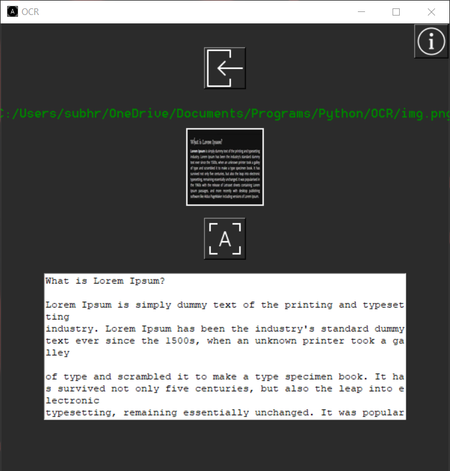

# OCR

OCR stands for "Optical Character Recognition." It is a technology that recognizes text within a digital image. 

## Screenshots



## Features:

Extracting text from any text image and info page on how to get the best results.

## Running Tests

There are two files:
1. [![Core]](ocr_core.py) - This is a stand-alone code of the OCR used in the main App.
2. [![OCR App]](main.py) - This is the code with OCR Core implemented with a Graphical User Interface. 

## Installation
1. Install Tesseract
```bash
pip install pytesseract
```
2. Install OpenCV
```bash
pip install opencv-python
```
4. Install PILLOW
```bash
pip install PILLOW
```
5. Edit the file paths

    
